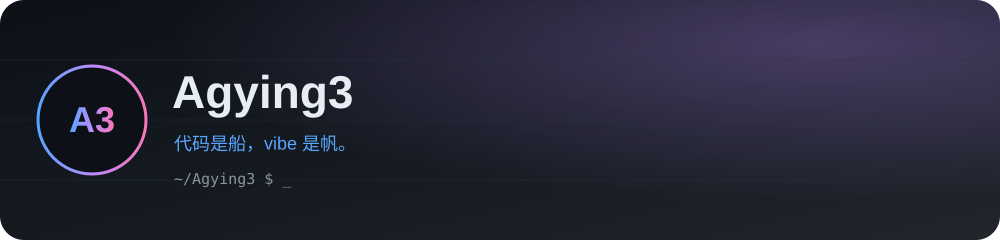
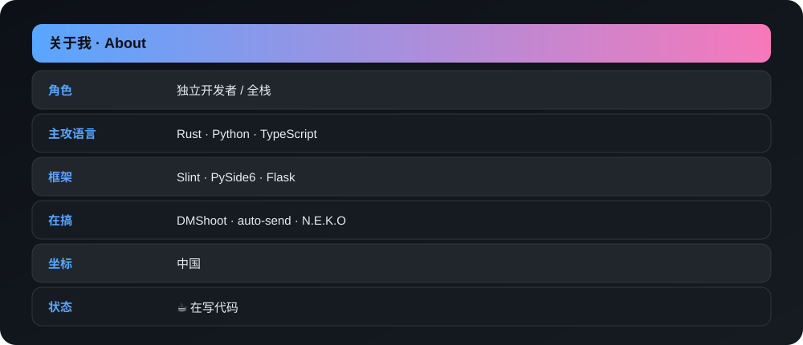
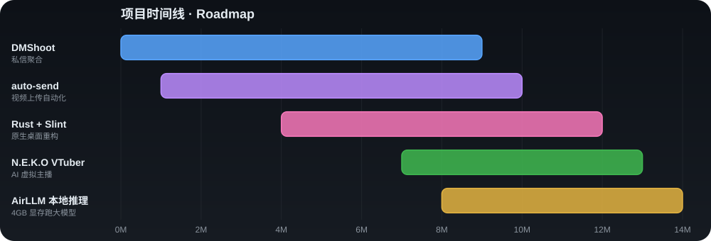

<!-- 顶部暗色 banner（本地 SVG，永远加载，不依赖图床） -->

  

---

### 🪪 关于我

  

### 📈 心情 K 线（装饰）

  

### 🗓️ 项目时间线 · Roadmap

  

### 🧰 技术栈

  
  
  
  
  
  

### 📊 数据面板

  
  

  

### 🔗 链接

  

<h3 align="center">🐾 谢谢你来看我的小天地 🐾</h3>

  

