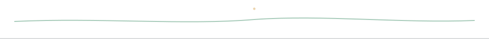
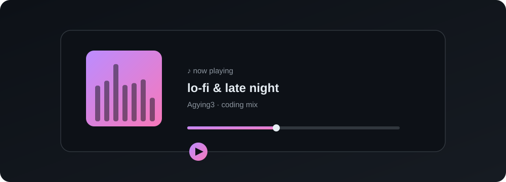
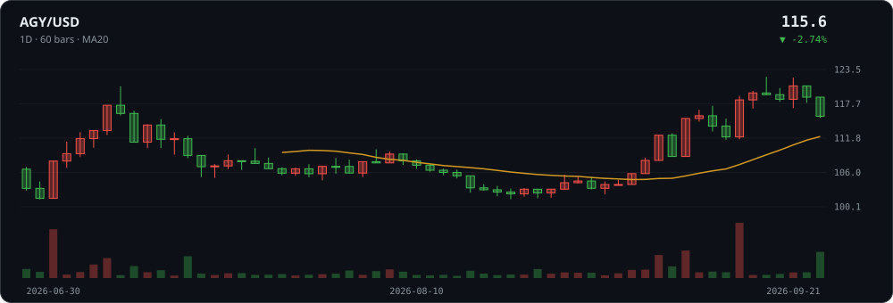
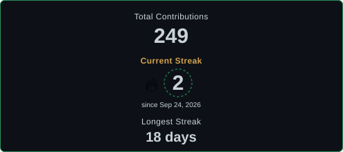
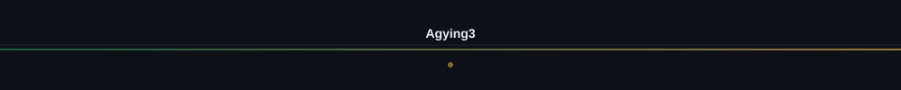
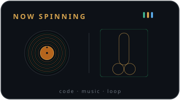

  

  <a href="https://github.com/Agying3">
    <picture>
      <source media="(prefers-color-scheme: dark)" srcset="assets/banner_dark.svg">
      <source media="(prefers-color-scheme: light)" srcset="assets/banner_light.svg">
      
    </picture>
  </a>

  
  

  
  

  <a href="https://github.com/Agying3">
    <picture>
      <source media="(prefers-color-scheme: dark)" srcset="assets/scene_sakura.svg">
      <source media="(prefers-color-scheme: light)" srcset="assets/scene_sakura.svg">
      
    </picture>
  </a>

  <picture>
    <source media="(prefers-color-scheme: dark)" srcset="https://visitor-badge.laobi.icu/badge?page_id=Agying3.Agying3&left_color=21262d&right_color=d4a24e&left_text=VISITORS">
    <source media="(prefers-color-scheme: light)" srcset="https://visitor-badge.laobi.icu/badge?page_id=Agying3.Agying3&left_color=f6f8fa&right_color=b8860b&left_text=VISITORS">
    
  </picture>

  <a href="https://github.com/Agying3">
    <picture>
      <source media="(prefers-color-scheme: dark)" srcset="assets/wave_dark.svg">
      <source media="(prefers-color-scheme: light)" srcset="assets/wave_light.svg">
      
    </picture>
  </a>

  👇 点击图片可跳转对应页面

<table>
  <tr>
    <td align="center" width="50%">
      <a href="https://github.com/Agying3">
        <picture>
          <source media="(prefers-color-scheme: dark)" srcset="assets/scene_night_dark.svg">
          <source media="(prefers-color-scheme: light)" srcset="assets/scene_night_light.svg">
          
        </picture>
      </a>
    </td>
    <td align="center" width="50%">
      <a href="https://github.com/Agying3">
        <picture>
          <source media="(prefers-color-scheme: dark)" srcset="assets/scene_music_dark.svg">
          <source media="(prefers-color-scheme: light)" srcset="assets/scene_music_light.svg">
          
        </picture>
      </a>
    </td>
  </tr>
  <tr>
    <td align="center" width="50%">
      <a href="https://github.com/Agying3">
        <picture>
          <source media="(prefers-color-scheme: dark)" srcset="assets/kline_dark.svg">
          <source media="(prefers-color-scheme: light)" srcset="assets/kline_light.svg">
          
        </picture>
      </a>
    </td>
    <td align="center" width="50%">
      <a href="https://github.com/Agying3?tab=repositories">
        <picture>
          <source media="(prefers-color-scheme: dark)" srcset="assets/wheel_dark.svg">
          <source media="(prefers-color-scheme: light)" srcset="assets/wheel_light.svg">
          
        </picture>
      </a>
    </td>
  </tr>
</table>

  
  
  

<table>
  <tr>
    <td align="center" width="50%">
      <a href="https://github.com/Agying3">
        <picture>
          <source media="(prefers-color-scheme: dark)" srcset="https://stats.programcx.cn/api?username=Agying3&show_icons=true&hide_border=true&bg_color=0d1117&title_color=d4a24e&icon_color=2f8f5f&text_color=c9d1d9">
          <source media="(prefers-color-scheme: light)" srcset="https://stats.programcx.cn/api?username=Agying3&show_icons=true&hide_border=true&bg_color=ffffff&title_color=b8860b&icon_color=2f8f5f&text_color=1f2328">
          
        </picture>
      </a>
    </td>
    <td align="center" width="50%">
      
    </td>
  </tr>
</table>

  

  <a href="https://github.com/Agying3">
    <picture>
      <source media="(prefers-color-scheme: dark)" srcset="assets/wave_dark.svg">
      <source media="(prefers-color-scheme: light)" srcset="assets/wave_light.svg">
      
    </picture>
  </a>

  <a href="https://github.com/Agying3">
    <picture>
      <source media="(prefers-color-scheme: dark)" srcset="assets/footer_dark.svg">
      <source media="(prefers-color-scheme: light)" srcset="assets/footer_light.svg">
      
    </picture>
  </a>

<!-- DRAWING_CARD_BOTTOM:START -->

  

<!-- DRAWING_CARD_BOTTOM:END -->
